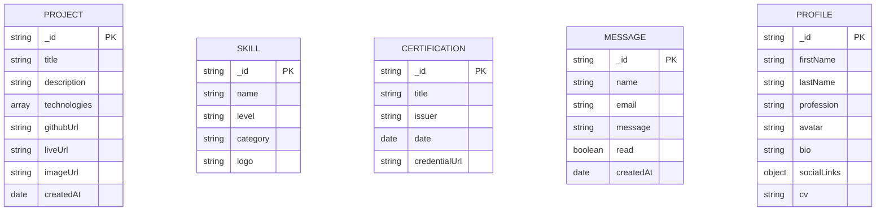

# 🚀 Raid Boukherouba - Full Stack Developer Portfolio

## 1. 📄 Abstract

This portfolio showcases my skills, projects, and professional journey as a full-stack developer. It serves as a comprehensive digital representation of my technical capabilities, featuring:

* My professional background and expertise
* A collection of completed projects with detailed case studies
* Technical skills across frontend, backend, and DevOps
* Academic qualifications and professional certifications
* A contact system for potential collaborations

The portfolio is built with modern web technologies and features a responsive design that works across all devices. It demonstrates my ability to create clean, efficient, and user-friendly applications while highlighting my problem-solving approach to software development.

## 2. 📚 Data Dictionary

### Profile Collection
| Field | Type | Description |
|-------|------|-------------|
| firstName | String | User's first name |
| lastName | String | User's last name |
| profession | String | Professional title |
| avatar | String | URL to profile image |
| bio | String | Professional biography |
| socialLinks | Object | Links to social media profiles |
| cv | String | URL to downloadable CV |

### Project Collection
| Field | Type | Description |
|-------|------|-------------|
| title | String | Project name |
| description | String | Detailed project description |
| technologies | Array | Technologies used |
| githubUrl | String | Link to GitHub repository |
| liveUrl | String | Link to live demo |
| imageUrl | String | Project thumbnail image |

### Skill Collection
| Field | Type | Description |
|-------|------|-------------|
| name | String | Skill name |
| level | String | Proficiency level |
| category | String | Skill category |
| logo | String | Skill icon/image |

### Certification Collection
| Field | Type | Description |
|-------|------|-------------|
| title | String | Certification name |
| issuer | String | Issuing organization |
| date | Date | Date obtained |
| credentialUrl | String | Verification URL |

### Message Collection
| Field | Type | Description |
|-------|------|-------------|
| name | String | Sender's name |
| email | String | Sender's email |
| message | String | Message content |
| read | Boolean | Read status |

## 3. 🧠 Collections



## 4. 🐳 How to Use Docker (optional)

for easier deployment and development. i have containerized This project using Docker. The setup includes containers for the client (React app), server (Express API), and optionally a database (e.g., MongoDB).

### 4.1 🛠️ Prerequisites:
- Docker
- Docker Compose

### 4.2 🚀 Running the App:
- Clone the Repository:
```bash
git clone https://github.com/raidboukherouba/portfolio.git
cd your-portfolio
```
- Build and Start Containers:
```bash
docker-compose up --build
```

- Access the App:
* Frontend: http://localhost:3000
* Backend API: http://localhost:5000

## 5. 🤝 Contributing

While this is a personal portfolio, I welcome suggestions and feedback:

1. Open an issue to discuss potential changes
2. Fork the repository (if source is available)
3. Create a feature branch (`git checkout -b feature/your-feature-name`)
4. Commit your changes (`git commit -m 'Add some feature'`)
5. Push to the branch (`git push origin feature/your-feature-name`)
6. Open a pull request

## 6. 📜 License

This portfolio is developed and maintained by *Boukherouba Raid*. The content is proprietary but the underlying code (when available) is licensed under MIT License, See the [LICENSE](./LICENSE) file for details.

## 7. 📧 Contact

For professional inquiries or collaboration opportunities:
- ✉️ **Email**: raidboukherouba@gmail.com
- 🐙 **GitHub**: raidboukherouba